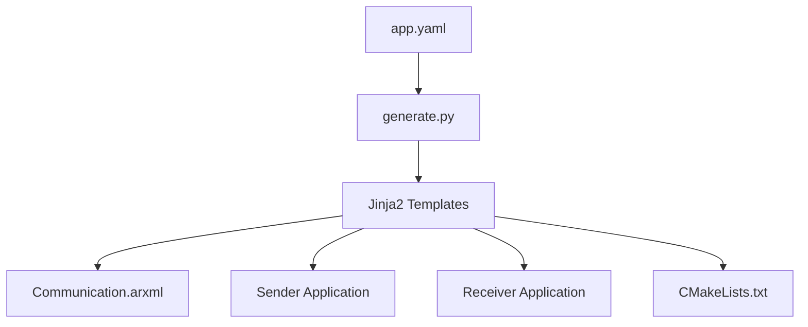
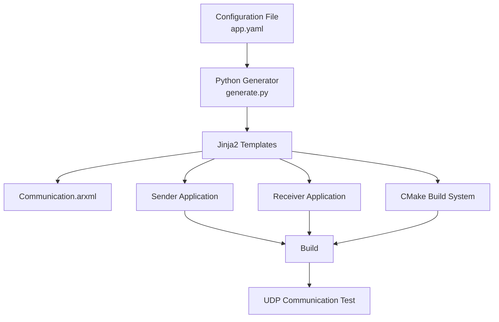
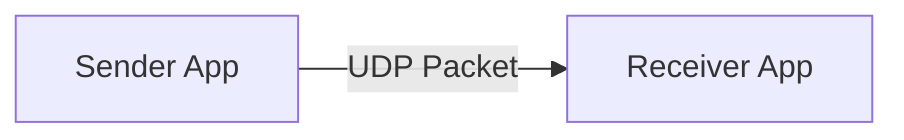
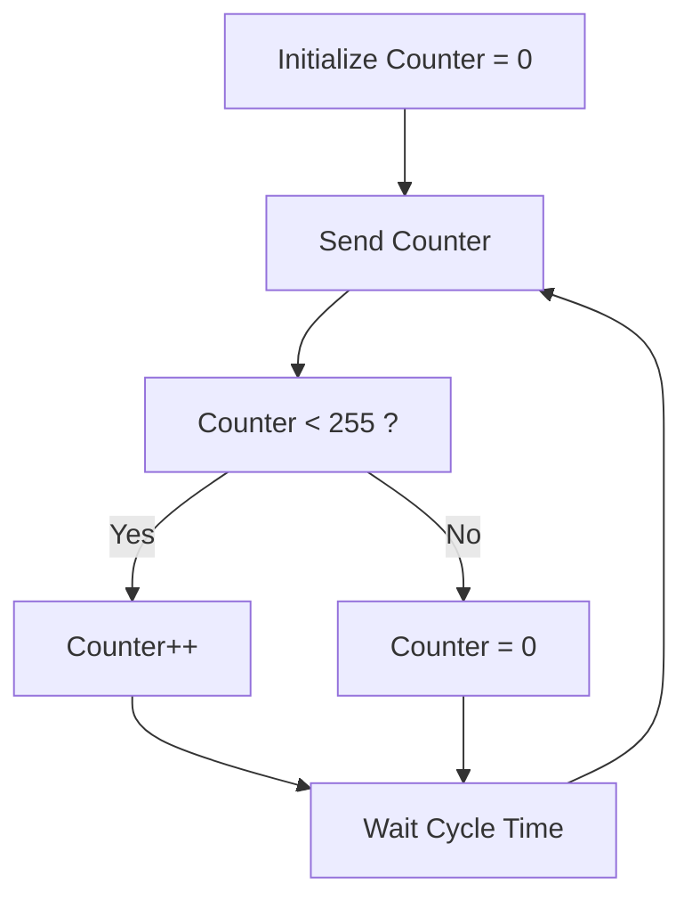

# Autosar Communication Generator

AUTOSAR Adaptive Platform 開発で得た知見を活かし、**YAML設定ファイルから ARXML と C++送受信アプリケーションを自動生成するコードジェネレータ**を開発しました。

生成されたアプリケーションは UDP 通信による疎通確認を目的としており、送信側は 1Byte カウンタを周期送信します。

---

## Counter Behavior

```text
0 → 1 → 2 → ... → 254 → 255 → 0 → ...
```

---

## Features

- YAMLベースの通信設定
- ARXML自動生成
- Sender / Receiver C++コード自動生成
- Jinja2テンプレートによるコード生成
- CMakeプロジェクト自動生成
- UDP通信による疎通確認
- 1Byteカウンタの周期送信
- AUTOSARライクな開発フローの再現

---

## System Overview



---

## Generation Flow



---

## Communication Flow



---

## Sender Behavior



---

## Project Structure

```text
autosar-communication-generator
│
├── config
│   └── app.yaml
│
├── generator
│   └── generate.py
│
├── templates
│   ├── CMakeLists.txt.j2
│   ├── arxml
│   │   └── Communication.arxml.j2
│   ├── include
│   │   ├── Sender.hpp.j2
│   │   └── Receiver.hpp.j2
│   └── src
│       ├── Sender.cpp.j2
│       ├── SenderMain.cpp.j2
│       ├── Receiver.cpp.j2
│       └── ReceiverMain.cpp.j2
│
└── generated
    ├── CMakeLists.txt
    ├── CommunicationDemo.arxml
    ├── include
    │   ├── Sender.hpp
    │   └── Receiver.hpp
    └── src
        ├── Sender.cpp
        ├── SenderMain.cpp
        ├── Receiver.cpp
        └── ReceiverMain.cpp
```

---

## Example Configuration

```yaml
application:
  name: CommunicationDemo

communication:
  protocol: UDP

sender:
  app_name: Sender
  ip_address: "192.168.10.100"
  mac_address: "00:11:22:33:44:55"
  port: 50000

receiver:
  app_name: Receiver
  ip_address: "192.168.10.101"
  mac_address: "AA:BB:CC:DD:EE:FF"
  port: 50001

signal:
  name: CounterSignal
  data_type: uint8
  data_size_byte: 1
  cycle_ms: 100
  initial_value: 0
```

---

## Build

### Generate Source Code

```bash
python generator/generate.py
```

### Build Generated Applications

```bash
cd generated

mkdir build
cd build

cmake ..
make
```

---

## Run

### Terminal 1

```bash
./receiver
```

### Terminal 2

```bash
./sender
```

---

## Expected Output

### Sender

```text
[TX] 0
[TX] 1
[TX] 2
[TX] 3
...
[TX] 254
[TX] 255
[TX] 0
```

### Receiver

```text
[RX] 0
[RX] 1
[RX] 2
[RX] 3
...
[RX] 254
[RX] 255
[RX] 0
```

---

## Motivation

This project was created to reproduce a simplified AUTOSAR-style development workflow.

### Objectives

- Configuration-driven development
- ARXML generation
- Communication application generation
- Automated code generation
- Build system generation
- Communication verification automation

The goal is to demonstrate AUTOSAR-related software architecture concepts without using proprietary automotive development assets.

---

## Future Enhancements

- TCP support
- Multiple signal generation
- Sender/Receiver Interface generation
- AUTOSAR Port generation
- Runnable generation
- GoogleTest auto-generation
- GitHub Actions CI/CD
- Adaptive AUTOSAR Service Interface generation