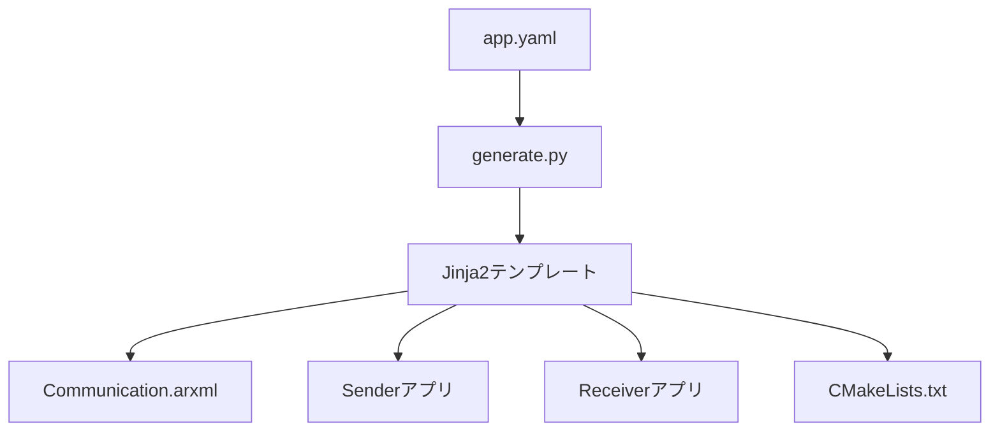
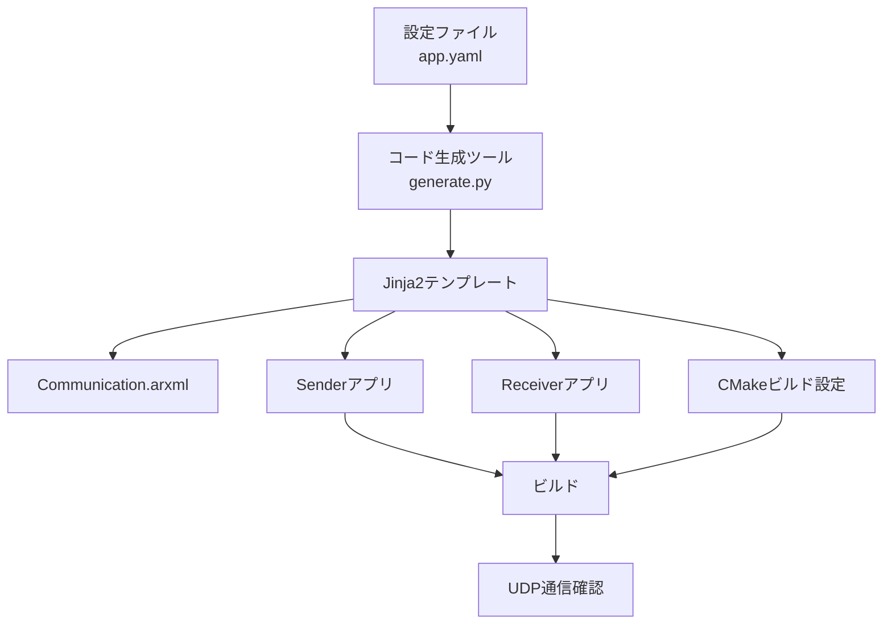
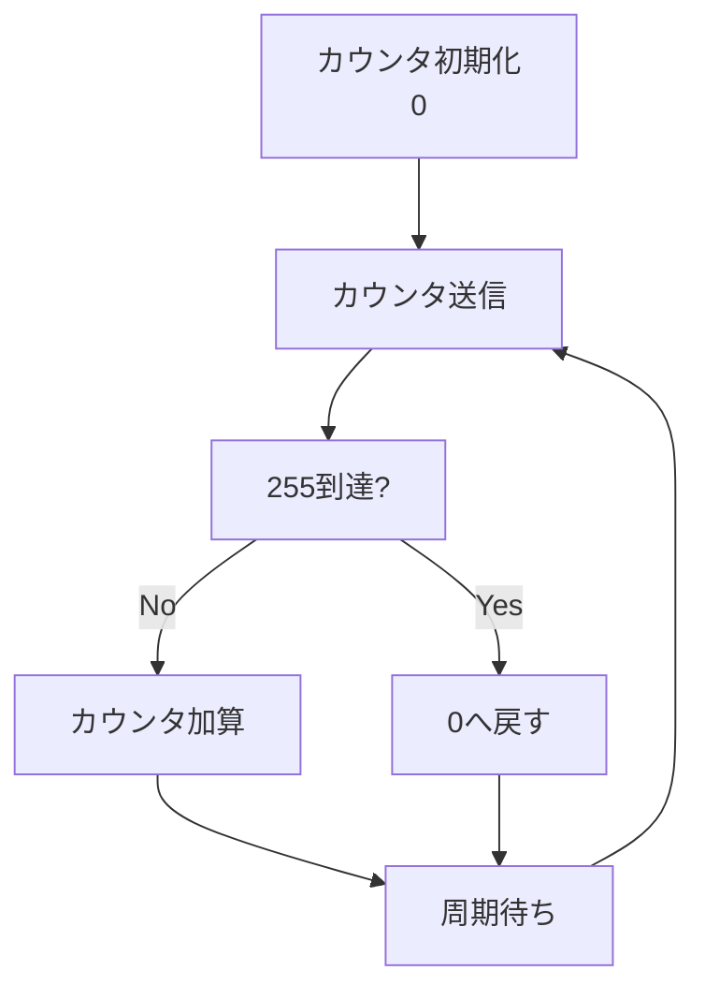

# Autosar Communication Generator

AUTOSAR Adaptive Platform 開発で得た知見を活かし、**YAML設定ファイルからARXMLおよびC++送受信アプリケーションを自動生成するコードジェネレータ**を作成しました。

設定ファイルを変更するだけで、通信設定に応じたARXMLや送受信アプリケーションを生成できます。

生成されたアプリケーションはUDP通信による疎通確認を目的としており、送信側は1Byteカウンタを周期送信します。

---

## カウンタ動作

```text
0 → 1 → 2 → ... → 254 → 255 → 0 → ...
```

---

## 主な機能

- YAMLによる通信設定
- ARXML自動生成
- Senderアプリ自動生成
- Receiverアプリ自動生成
- Jinja2によるコード生成
- CMakeプロジェクト自動生成
- UDP通信による疎通確認
- 1Byteカウンタの連続送信
- AUTOSARライクな開発フローの再現

---

## システム全体構成



---

## コード生成フロー



---

## 通信構成


---

## Sender動作



---

## ディレクトリ構成

```text
autosar-communication-generator
│
├── config
│   └── app.yaml
│
├── generator
│   └── generate.py
│
├── templates
│   ├── CMakeLists.txt.j2
│   ├── arxml
│   │   └── Communication.arxml.j2
│   ├── include
│   │   ├── Sender.hpp.j2
│   │   └── Receiver.hpp.j2
│   └── src
│       ├── Sender.cpp.j2
│       ├── SenderMain.cpp.j2
│       ├── Receiver.cpp.j2
│       └── ReceiverMain.cpp.j2
│
└── generated
    ├── CMakeLists.txt
    ├── CommunicationDemo.arxml
    ├── include
    │   ├── Sender.hpp
    │   └── Receiver.hpp
    └── src
        ├── Sender.cpp
        ├── SenderMain.cpp
        ├── Receiver.cpp
        └── ReceiverMain.cpp
```

---

## 設定ファイル例

```yaml
application:
  name: CommunicationDemo

communication:
  protocol: UDP

sender:
  app_name: Sender
  ip_address: "192.168.10.100"
  mac_address: "00:11:22:33:44:55"
  port: 50000

receiver:
  app_name: Receiver
  ip_address: "192.168.10.101"
  mac_address: "AA:BB:CC:DD:EE:FF"
  port: 50001

signal:
  name: CounterSignal
  data_type: uint8
  data_size_byte: 1
  cycle_ms: 100
  initial_value: 0
```

---

## ビルド方法

### コード生成

```bash
python generator/generate.py
```

### ビルド

```bash
cd generated

mkdir build
cd build

cmake ..
make
```

---

## 実行方法

### ターミナル1

```bash
./receiver
```

### ターミナル2

```bash
./sender
```

---

## 実行結果例

### Sender

```text
[TX] 0
[TX] 1
[TX] 2
...
[TX] 254
[TX] 255
[TX] 0
```

### Receiver

```text
[RX] 0
[RX] 1
[RX] 2
...
[RX] 254
[RX] 255
[RX] 0
```

---

## 作成目的

業務で携わっているAUTOSAR Adaptive Platform開発の経験をもとに、設定ファイルから各種成果物を自動生成する開発フローを個人プロジェクトとして再現することを目的に作成しました。

特に以下の技術要素を学習・整理することを意識しています。

- AUTOSAR
- ARXML
- Python
- Jinja2
- コード生成
- UDP通信
- CMake

---

## 今後の拡張案

- TCP通信への対応
- 複数Signal対応
- Sender/Receiver Interface生成
- AUTOSAR Port生成
- Runnable生成
- GoogleTest自動生成
- GitHub ActionsによるCI/CD
- AUTOSAR Adaptive Service Interface生成